<br>
<br>

<div style="text-align: center;">
  
</div>

<br>
<br>
<br>

<div style="text-align: center;">
  <font size="4"><strong>Project Report</strong></font>
</div>

<br>
<br>
<br>

<div style="text-align: center;">
  <font size="6.9">Exploring Image Segmentation</font>
</div>
<br>
<div style="text-align: center;">
  <font size="6.9">With OpenCV</font>
</div>

<br>
<br>
<br>

<div style="text-align: center;">
  <font size="3"><em>by</em></font>
</div>
<br>
<div style="text-align: center;">
  <font size="4">Minh Kien Nguyen</font>
  <br>
  <font size="3">minh.nguyen4@stud.fra-uas.de</font>
  <br>
</div>

<br>
<br>

<div style="text-align: center;">
  <font size="3"><strong>Supervisor</strong></font>
  <br>
  <font size="4">Prof. Dr. Peter Nauth</font>
</div>

<br>
<br>

<div style="text-align: center;">
  <font size="3"><strong>Submission Date</strong></font>
  <br>
  <font size="4">February 19th, 2025</font>
</div>


<div style="page-break-after: always"></div>

**Table of Contents**
- [Overview](#overview)
- [Setup/Preconfiguration](#setuppreconfiguration)
- [Watershed](#watershed)
- [Suzuki](#suzuki)
- [Niblack](#niblack)
- [References](#references)


# Overview

**Introduction**

The project *Exploring Image Segmentation With OpenCV* is part of the Bilderkennung SS24 module of Prof. Dr. Peter Nauth at the Frankfurt University of Applied Sciences.

**Objective**

This project aims to 
- present possible ways of segmenting images with traditional computer vision algorithms in OpenCV instead of machine learning models.
- show the influence of each image processing step on the final segmentation result

**Source Code**

[Link](https://github.com/krieger1512/Bild1_Segmentation)

**Project Structure**

The project is divided into three parts:
1. Image segmentation with watershed algorithm (``watershed.py``) &rarr; See section [Watershed](#watershed)
2. Image segmentation with Suzuki algorithm (``suzuki.py``) &rarr; See section [Suzuki](#suzuki)
3. Image segmentation with Niblack edge detection (``niblack.py``) &rarr; See section [Niblack](#niblack)

The three parts differ in the algorithms used for binarization and labeling segments / finding contours. The project focuses on using the OpenCV implementation of these algorithms to segment images, thus details about them will only be referenced.

| Part      | Binarization | Labelling Segments / Finding Contours |
| --------- | ------------ | ------------------------------------- |
| Watershed | Otsu [1]     | Watershed [2]                         |
| Suzuki    | Otsu [1]     | Suzuki [3]                            |
| Niblack   | Niblack [4]  | Suzuki [3]                            |

<div style="page-break-after: always"></div>

# Setup/Preconfiguration

**Purpose**

To run the given ``.py`` files, setup/preconfiguration needs to be done (only once).

**Requirements**

``Python 3.4+`` and ``pip`` (included in `Python 3.4+` by default)

**Step-by-Step**

Follow these steps in your terminal (e.g., Command Prompt on Windows):
1. Clone the project source code:

    ```
    git clone https://github.com/krieger1512/Bild1_Segmentation.git
    ```

2. Change directory to project folder after cloning it
    ```
    # For Windows
    cd Bild1_Segmentation
    ```
3. Create virtual environment:
    ```
    # Use .venv as name of virtual environment
    python -m venv .venv 
    ```
4. Activate virtual environment:
    ```
    # For Windows
    .venv/Scripts/activate
    ```
    Whenever running the given ``.py`` files, make sure the virtual environment is activated beforehand
5. Install the necessary modules/libraries:
    ```
    pip install -r requirements.txt    
    ```
<div style="page-break-after: always"></div>

# Watershed

This part uses [Otsu's method](https://learnopencv.com/otsu-thresholding-with-opencv/) for binarization and [Watershed algorithm](https://en.wikipedia.org/wiki/Watershed_(image_processing)) for labelling segments.

**Step-by-Step Architecture**

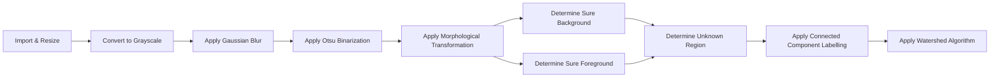

**Step-by-Step Explanation**

- ``Import & Resize``: 
  
  Load the input image that needs to be segmented and resize it if necessary.

  
- ``Convert to Grayscale``:
  
  Convert the imported image to grayscale. Each pixel in the image now ranges from 0 to 255.

  
- ``Apply Gaussian Blur``:
  
  Blur the grayscale image with Gaussian blur for better binarization result in the subsequent step.

  
- ``Apply Otsu Binarization``:
  
  Use Otsu's method to divide the blurred image in foreground pixels (i.e., pixels representing objects) which are set to 255 and background pixels which are set to 0. Otsu's method determines (global) threshold automatically (i.e., adaptive thresholding).

  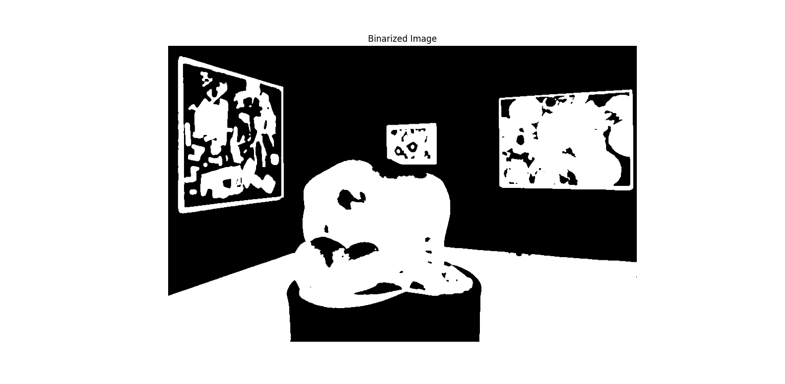
- ``Apply Morphological Transformation``
  
  Apply morphological transformation to further reduce "noise" in the binary image. The goal is to eliminate groups of white or black points that are big enough to be a segment, but not big enough to represent the whole object that we want.

  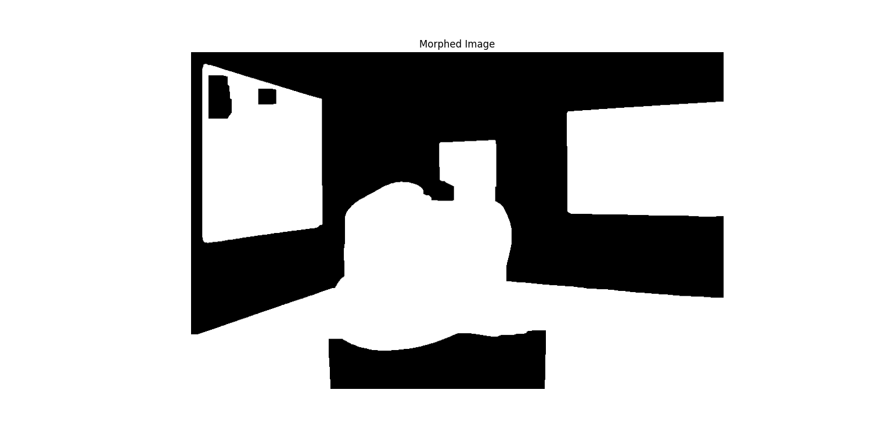
- ``Determine Sure Background``

  Determine regions that are definitely background. This is done by dilating the foreground objects (i.e., increasing their sizes and boundaries to the background) in the morphed image, so that the remaining background regions are certainly background. 

  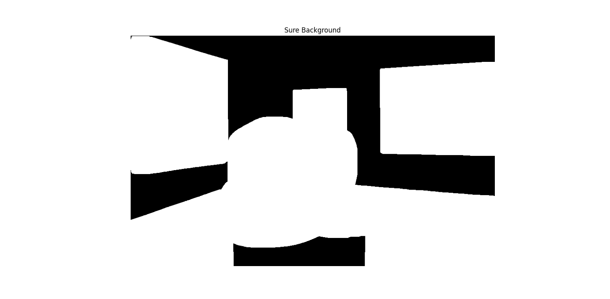
- ``Determine Sure Foreground``

  Determine regions that are definitely foreground. For that purpose, first apply distance transform to the morphed image. The result is an image with brighter pixels indicating higher (Euclidean) distances to the nearest background pixel. Based on this result, select a threshold level for determining sure foreground regions (e.g., 70% of the maximum distance found by the distance transform). Pixels with distance transform values higher than the selected threshold level are set as sure foreground.

  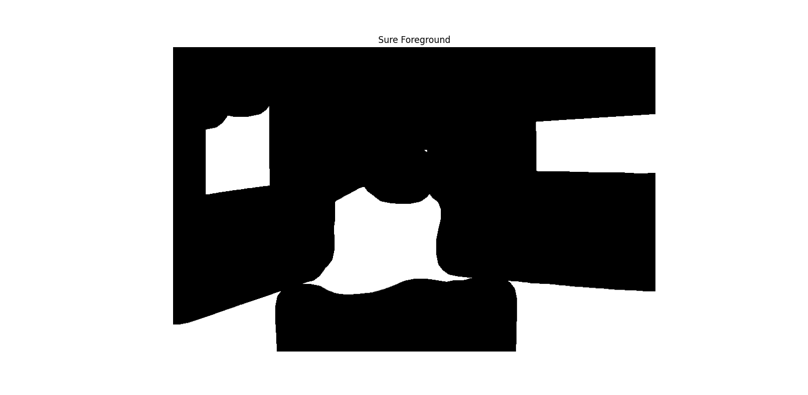
- ``Determine Unknown Region``

  Determine regions that are neither sure background nor sure foreground. This is done by substracting the sure foreground from the sure background. The unknown region is key for the Watershed algorithm because it signifies the transition region between distinct objects or between an object and the background.

  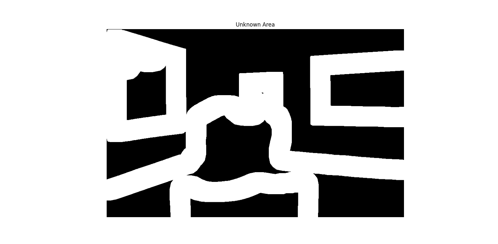
- ``Apply Connected Component Labelling``

  Label unknown pixels, sure background pixels, and groups of sure foreground pixels that belong together with numbers (i.e., markers). Unknown pixels are labeled as 0, sure background pixels are labeled as 1, and sure foreground pixels are labeled starting from 2.
- ``Apply Watershed Algorithm``

  Apply the Watershed algorithm to the above markers. Water will start rising from "valleys" - sure foreground pixels of the same marker. Each valley has a different marker. When the water rises, each pixel that the water touches (except sure background ones) gets the same marker as the valley the water originated from. Sure background pixels are considered peaks and will not be marked. The unknown pixels where the water reaches the peaks or water of different valleys meet are considered (object) boundaries and marked with -1. The algorithm stops when there is no unknown pixel left.

  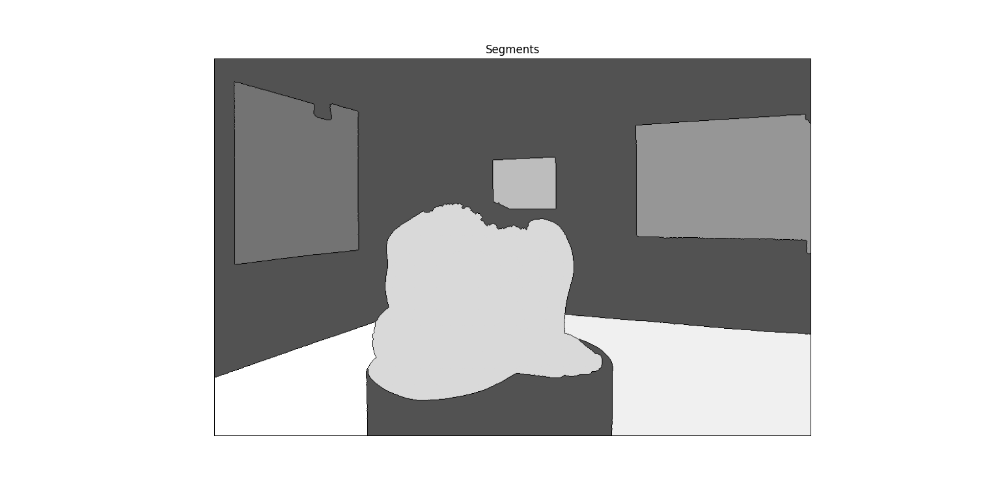

  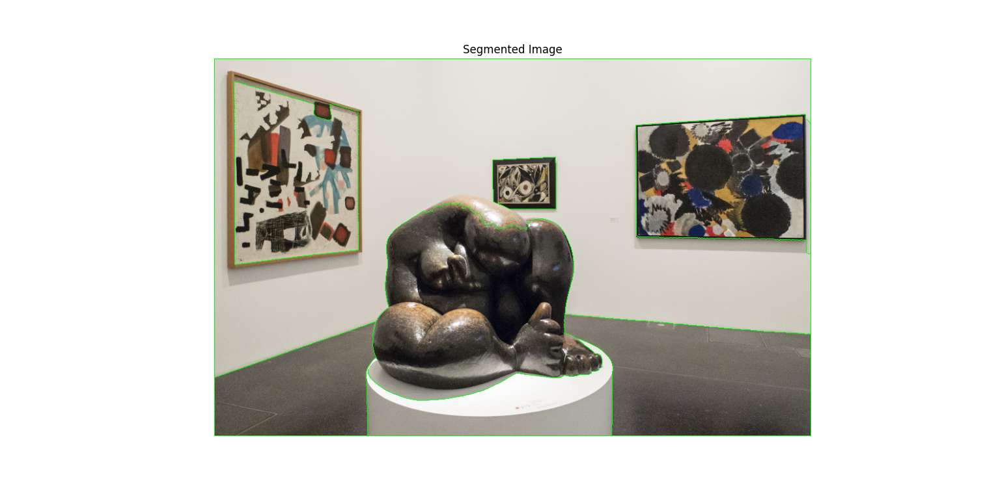

**Controller**

This project provides a controller for checking the influences of different parameters (that control the above steps) on the interim/final segmentation results. Below is the list of available parameters and their meanings:

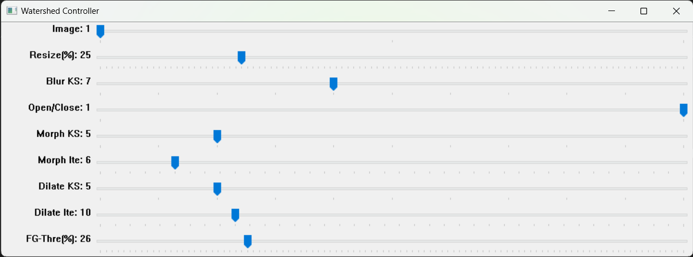

- ``Image``: ID of the image that needs to be segmented. These images can be found inside the ``input`` folder. 
- ``Resize(%)``: Downscale ratio, ranging from 1% to 100%
- ``Blur KS``: Kernel size of Gaussian blur. Must be an odd number. By default the even-number kernel size will be incremented to make it odd-number.
- ``Open/Close``: Morphological transformation to be applied: `0` means opening, while `1` means closing.
- ``Morph KS``: Kernel size of the selected morphological transformation. Must be an odd number. By default the even kernel size will be incremented to make it odd.
- ``Morph Ite``: Number of iterations (times) the selected morphological transformation is applied.
- ``Dilate KS``: Kernel size of the dilation used for finding sure background pixels. Must be an odd number. By default the even kernel size will be incremented to make it odd.
- ``Dilate Ite``: Number of iterations (times) the dilation used for finding sure background pixels is applied.
- ``FG-Thre(%)``: Threshold level for determining sure foreground pixels, ranging from 1% to 100%.

<div style="page-break-after: always"></div>

# Suzuki

This part uses [Otsu's method](https://learnopencv.com/otsu-thresholding-with-opencv/) for binarization and [Suzuki algorithm](https://theailearner.com/2019/11/19/suzukis-contour-tracing-algorithm-opencv-python/) for finding contours.

**Step-by-Step Architecture**

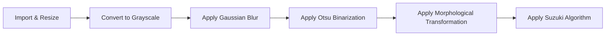

**Step-by-Step Explanation**

- ``Import & Resize``: 
  
  Load the input image that needs to be segmented and resize it if necessary.

  
- ``Convert to Grayscale``:
  
  Convert the imported image to grayscale. Each pixel in the image now ranges from 0 to 255.

  
- ``Apply Gaussian Blur``:
  
  Blur the grayscale image with Gaussian blur for better binarization result in the subsequent step.

  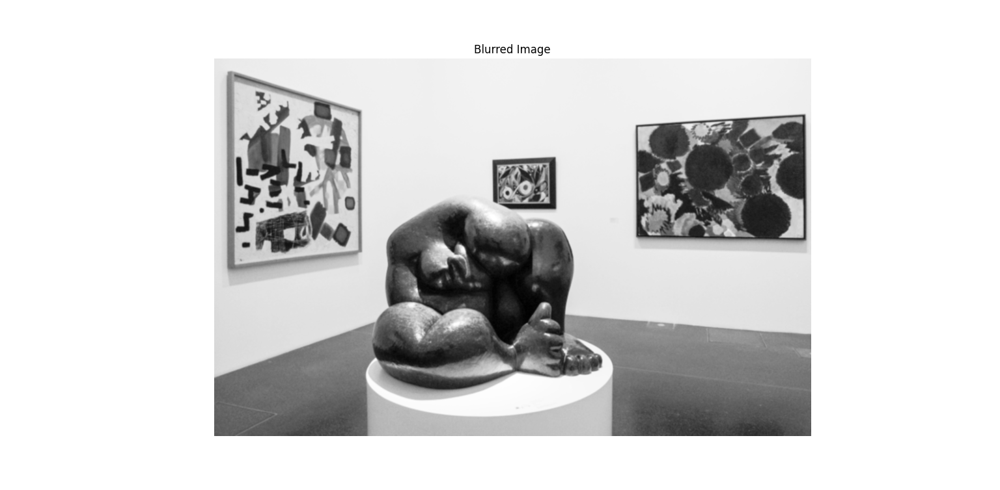
- ``Apply Otsu Binarization``:
  
  Use Otsu's method to divide the blurred image in foreground pixels (i.e., pixels representing objects) which are set to 255 and background pixels which are set to 0. Otsu's method determines (global) threshold automatically (i.e., adaptive thresholding).

  
- ``Apply Morphological Transformation``
  
  Apply morphological transformation to further reduce "noise" in the binary image.

  
- ``Apply Suzuki Algorithm``

  Apply the Suzuki algorithm to find contours in the morphed image. In the example we are only interested in the contours of the biggest objects (i.e., the three paintings, the statue, and the statue pedestal), and do not care about the smaller shapes in the paintings. Thus in the source code, the ``retrieval_mode`` is specified as ``RETR_EXTERNAL``, meaning we retrieve only the outer-most contours.

  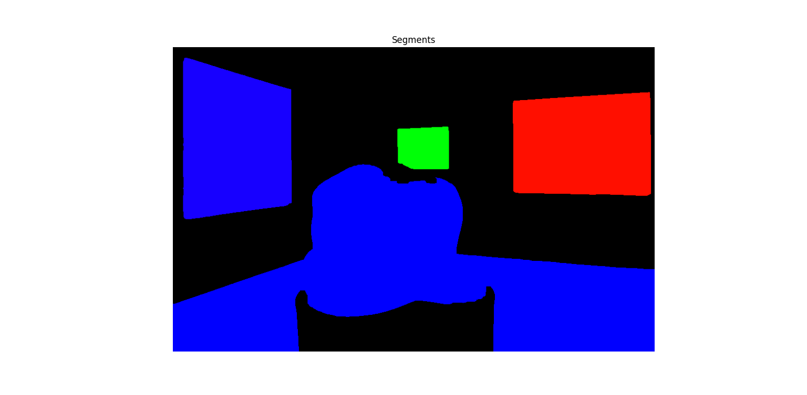

  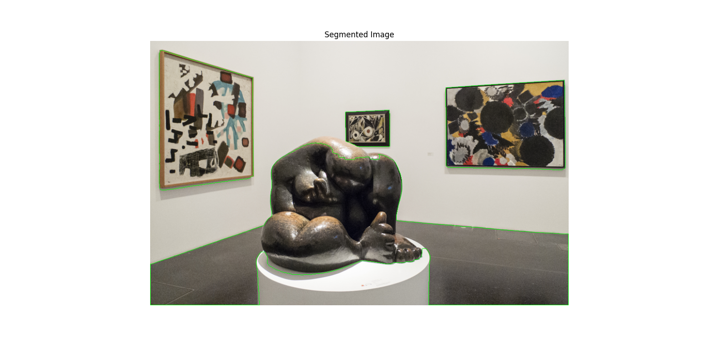

**Controller**

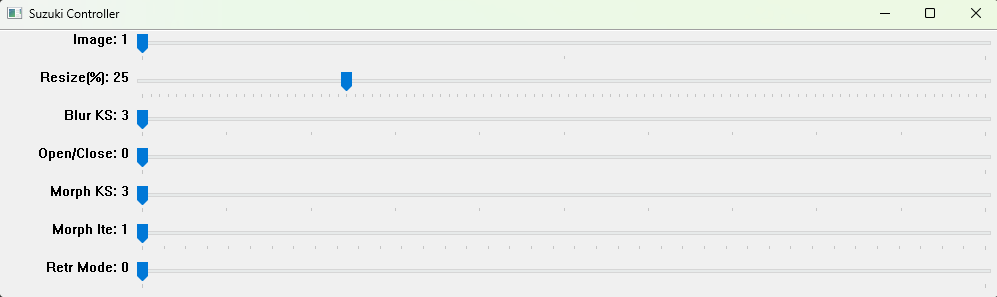

This project provides a controller for checking the influences of different parameters (that control the above steps) on the interim/final segmentation results. Below is the list of available parameters and their meanings:
- ``Image``: ID of the image that needs to be segmented. These images can be found inside the ``input`` folder. 
- ``Resize(%)``: Downscale ratio, ranging from 1% to 100%
- ``Blur KS``: Kernel size of Gaussian blur. Must be an odd number. By default the even-number kernel size will be incremented to make it odd-number.
- ``Open/Close``: Morphological transformation to be applied: `0` means opening, while `1` means closing.
- ``Morph KS``: Kernel size of the selected morphological transformation. Must be an odd number. By default the even kernel size will be incremented to make it odd.
- ``Morph Ite``: Number of iterations (times) the selected morphological transformation is applied.
- ``Retr Mode``: Retrieval mode for retrieving contours: `0` means ``RETR_EXTERNAL`` (get the outer-most contours and ignore the inner contours), while `1` means ``RETR_TREE`` (get all contours and create a full family hierarchy list).

<div style="page-break-after: always"></div>

# Niblack

This part uses [Niblack's method](https://craftofcoding.wordpress.com/2021/09/30/thresholding-algorithms-niblack-local/) for binarization and [Suzuki algorithm](https://theailearner.com/2019/11/19/suzukis-contour-tracing-algorithm-opencv-python/) for finding contours.

**Step-by-Step Architecture**

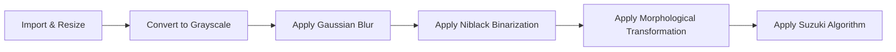

**Step-by-Step Explanation**

- ``Import & Resize``: 
  
  Load the input image that needs to be segmented and resize it if necessary.

  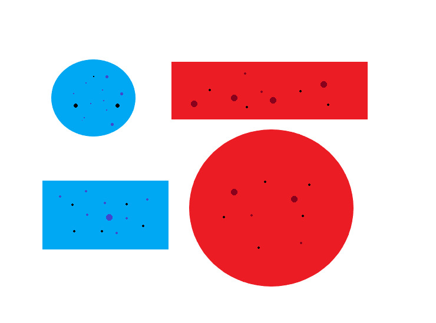
- ``Convert to Grayscale``:
  
  Convert the imported image to grayscale. Each pixel in the image now ranges from 0 to 255.

  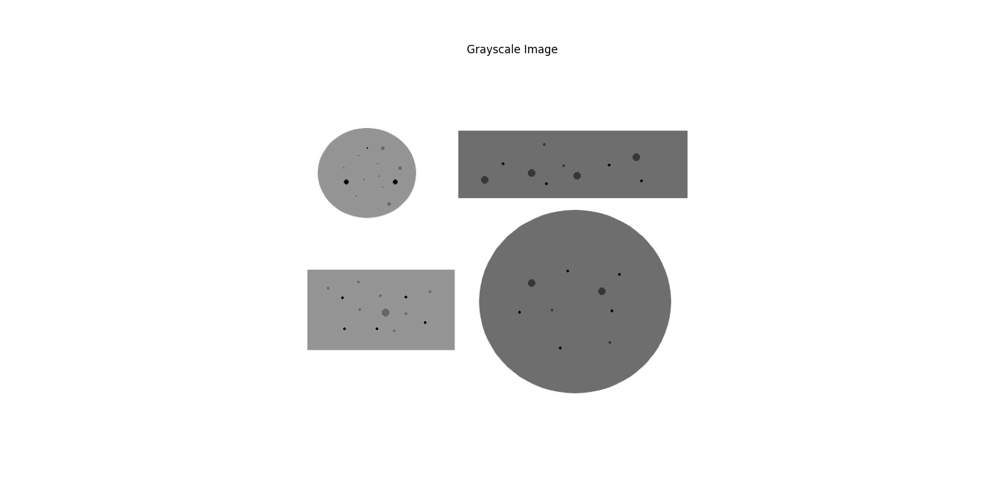
- ``Apply Gaussian Blur``:
  
  Blur the grayscale image with Gaussian blur for better binarization result in the subsequent step.

  
- ``Apply Niblack Binarization``:
  
  Use Niblack's method to detect edges. Niblack's method uses local adaptive thresholding.

  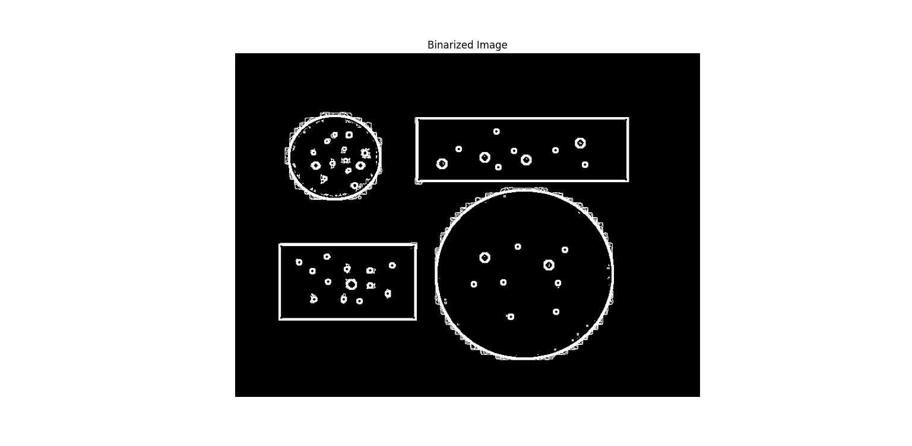
- ``Apply Morphological Transformation``
  
  Apply morphological transformation to further reduce "noise" in the binary image.

  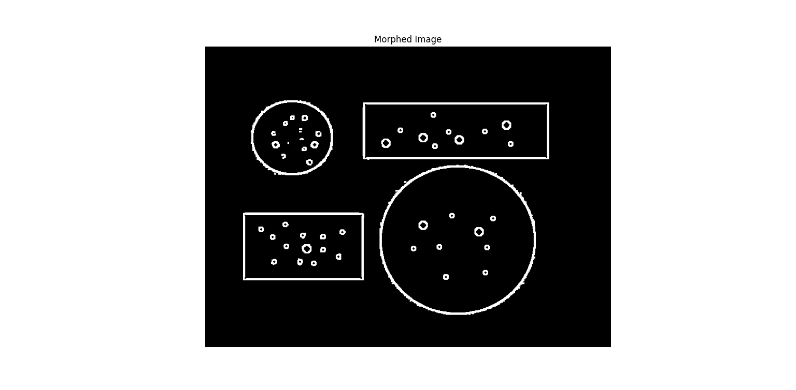
- ``Apply Suzuki Algorithm``

  Apply the Suzuki algorithm to find contours in the morphed image. In this example we are interested in all contours. Thus in the source code, the ``retrieval_mode`` is specified as ``RETR_TREE``, meaning we retrieve all available contours.

  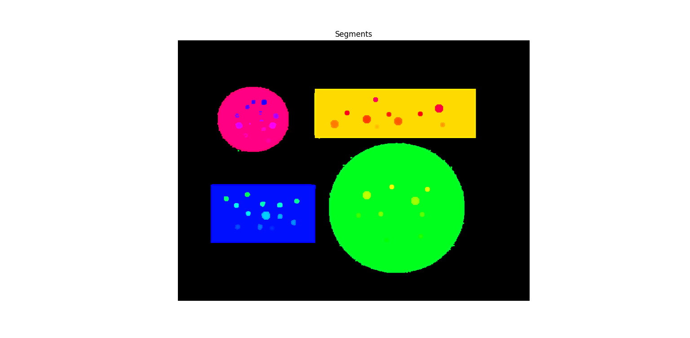

  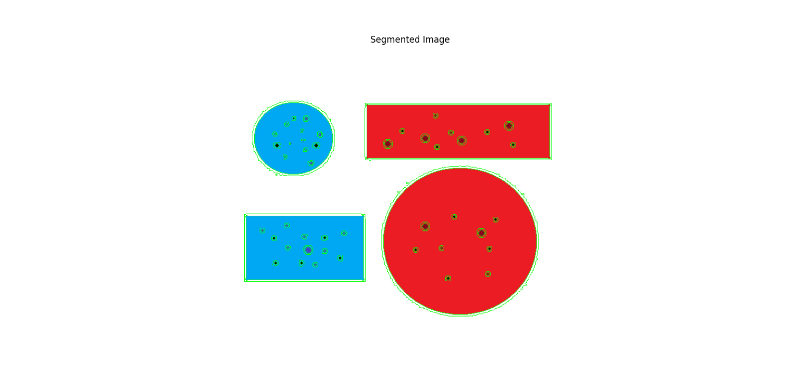

**Controller**

This project provides a controller for checking the influences of different parameters (that control the above steps) on the interim/final segmentation results. Below is the list of available parameters and their meanings:

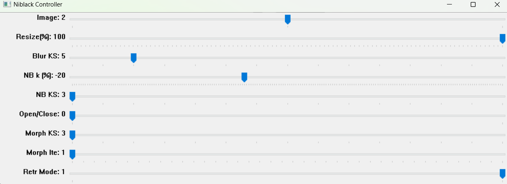

- ``Image``: ID of the image that needs to be segmented. These images can be found inside the ``input`` folder. 
- ``Resize(%)``: Downscale ratio, ranging from 1% to 100%
- ``Blur KS``: Kernel size of Gaussian blur. Must be an odd number. By default the even-number kernel size will be incremented to make it odd-number.
- ``NB k (%)``: Constant k used in Niblack binarization, ranging from -100% to 100%. 
- ``NB KS``: Kernel size used in Niblack binarization. Must be an odd number. By default the even kernel size will be incremented to make it odd.
- ``Open/Close``: Morphological transformation to be applied: `0` means opening, while `1` means closing.
- ``Morph KS``: Kernel size of the selected morphological transformation. Must be an odd number. By default the even kernel size will be incremented to make it odd.
- ``Morph Ite``: Number of iterations (times) the selected morphological transformation is applied.
- ``Retr Mode``: Retrieval mode for retrieving contours: `0` means ``RETR_EXTERNAL`` (get the outer-most contours and ignore the inner contours), while `1` means ``RETR_TREE`` (get all contours and create a full family hierarchy list).

<div style="page-break-after: always"></div>

# References

[1] N. Otsu, “A Threshold Selection Method from Gray-Level Histograms,” IEEE Transactions on Systems, Man, and Cybernetics, vol. 9, no. 1, pp. 62–66, Jan. 1979, doi: https://doi.org/10.1109/tsmc.1979.4310076.

[2] S. Beucher and C. Lantuéjoul, "Use of Watersheds in Contour Detection," in Proc. International Workshop on Image Processing: Real-time Edge and Motion Detection/Estimation, Rennes, France, 1979.

[3] S. Suzuki and K. be, “Topological structural analysis of digitized binary images by border following,” Computer Vision, Graphics, and Image Processing, vol. 30, no. 1, pp. 32–46, Apr. 1985, doi: https://doi.org/10.1016/0734-189x(85)90016-7.

[4] W. Niblack, An Introduction to Digital Image Processing. Prentice Hall, 1986.
‌