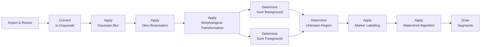
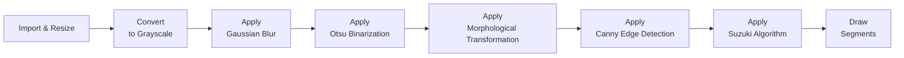
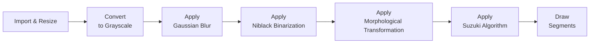

<br>
<br>

<div style="text-align: center;">
  
</div>

<br>
<br>
<br>

<div style="text-align: center;">
  <font size="4"><strong>Project Report</strong></font>
</div>

<br>
<br>
<br>

<div style="text-align: center;">
  <font size="6.9">Exploring Image Segmentation</font>
</div>
<br>
<div style="text-align: center;">
  <font size="6.9">With OpenCV</font>
</div>

<br>
<br>
<br>

<div style="text-align: center;">
  <font size="3"><em>by</em></font>
</div>
<br>
<div style="text-align: center;">
  <font size="4">Minh Kien Nguyen</font>
  <br>
  <font size="3">minh.nguyen4@stud.fra-uas.de</font>
  <br>
</div>

<br>
<br>

<div style="text-align: center;">
  <font size="3"><strong>Supervisor</strong></font>
  <br>
  <font size="4">Prof. Dr. Peter Nauth</font>
</div>

<br>
<br>

<div style="text-align: center;">
  <font size="3"><strong>Submission Date</strong></font>
  <br>
  <font size="4">July 22nd, 2024</font>
</div>


<div style="page-break-after: always"></div>

**Table of Contents**
- [Overview](#overview)
- [Setup/Preconfiguration](#setuppreconfiguration)
- [Watershed](#watershed)
- [Canny](#canny)
- [Niblack](#niblack)
- [References](#references)


# Overview

**Introduction**

The project *Exploring Image Segmentation With OpenCV* is part of the Bilderkennung SS24 module of Prof. Dr. Peter Nauth at the Frankfurt University of Applied Sciences.

**Objective**

This project aims to 
- present possible ways of segmenting images with traditional computer vision algorithms in OpenCV instead of machine learning models.
- show the influence of each image processing step on the final segmentation result

**Duration**

06.05.2024 - 22.07.2024

**Source Code**

[Link](https://github.com/krieger1512/Bild1_Segmentation)

**Project Structure**

The project is divided into three parts:
1. Image segmentation with watershed algorithm (``watershed.py``) &rarr; See section [Watershed](#watershed)
2. Image segmentation with Canny edge detection (``canny.py``) &rarr; See section [Canny](#canny)
3. Image segmentation with Niblack edge detection (``niblack.py``) &rarr; See section [Niblack](#niblack)

The three parts differ in the algorithms used for binarization and labeling. Details about each algorithm are provided in their respective sections.

| Part      | Binarization | Labelling |
| --------- | ------------ | --------- |
| Watershed | Otsu         | Watershed |
| Canny     | Otsu + Canny | Suzuki    |
| Niblack   | Niblack      | Suzuki    |

<div style="page-break-after: always"></div>

# Setup/Preconfiguration

**Purpose**

To run the given ``.py`` files, setup/preconfiguration needs to be done (only once).

**Requirements**

``Python 3.4+`` and ``pip`` (included in `Python 3.4+` by default)

**Step-by-Step**

Follow these steps in your terminal (e.g., Command Prompt on Windows):
1. Clone the project source code:

    ```
    git clone https://github.com/krieger1512/Bild1_Segmentation.git
    ```

2. Change directory to project folder after cloning it
    ```
    # For Windows
    cd Bild1_Segmentation
    ```
3. Create virtual environment:
    ```
    # Use .venv as name of virtual environment
    python -m venv .venv 
    ```
4. Activate virtual environment:
    ```
    # For Windows
    .venv/Scripts/activate
    ```
    Whenever running the given ``.py`` files, make sure the virtual environment is activated beforehand
5. Install the necessary modules/libraries:
    ```
    pip install -r requirements.txt    
    ```
<div style="page-break-after: always"></div>

# Watershed

**Description**

Any grayscale image can be viewed as a topographic surface where high intensity denotes peaks and hills while low intensity denotes valleys. You start filling every isolated valleys (local minima) with different colored water (labels). As the water rises, depending on the peaks (gradients) nearby, water from different valleys, obviously with different colors will start to merge. To avoid that, you build barriers in the locations where water merges. You continue the work of filling water and building barriers until all the peaks are under water. Then the barriers you created gives you the segmentation result. This is the "philosophy" behind the watershed. You can visit the CMM webpage on watershed to understand it with the help of some animations.

But this approach gives you oversegmented result due to noise or any other irregularities in the image. So OpenCV implemented a marker-based watershed algorithm where you specify which are all valley points are to be merged and which are not. It is an interactive image segmentation. What we do is to give different labels for our object we know. Label the region which we are sure of being the foreground or object with one color (or intensity), label the region which we are sure of being background or non-object with another color and finally the region which we are not sure of anything, label it with 0. That is our marker. Then apply watershed algorithm. Then our marker will be updated with the labels we gave, and the boundaries of objects will have a value of -1.

**Step-by-Step Architecture**



**Step-by-Step Explanation**

- *Import & Resize*:
- Convert to Grayscale
- Apply Gaussian Blur
- Apply Otsu Binarization
- Apply Morphological Transformation

**Workstation**


<div style="page-break-after: always"></div>

# Canny

**Description**

**Step-by-Step Architecture**



**Step-by-Step Explanation**

**Workstation**

<div style="page-break-after: always"></div>

# Niblack

**Description**

**Step-by-Step Architecture**



**Step-by-Step Explanation**

**Workstation**

<div style="page-break-after: always"></div>

# References